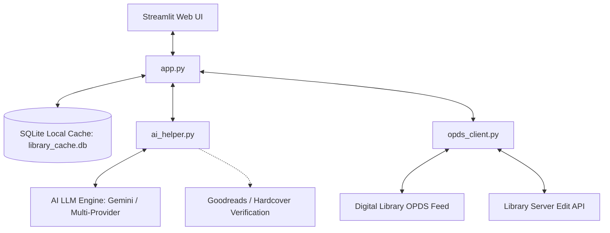

# 📚 ShelfMind

An intelligent, AI-powered companion application for digital book libraries (such as [Calibre-Web](https://github.com/janeczku/calibre-web)) that helps you manage, search, clean, and enrich your book catalog. Leveraging Streamlit, SQLite, and LLM APIs, **ShelfMind** analyzes your collection to identify missing sequence volumes, generates customized recommendations excluding books you already own, and batch-cleans inconsistent or missing catalog metadata.

---

## 🏗️ Architecture Overview

ShelfMind operates as an intelligent client layer alongside your digital library instance, using a local SQLite cache for ultra-fast search queries, metadata indexing, and series mapping:



*   **`app.py`**: The Streamlit interface, styling, layout, session state management, and user interaction.
*   **`database.py`**: Lightweight SQLite caching layer with parameterised queries and column allowlists to avoid querying the OPDS feed for every search or filter.
*   **`opds_client.py`**: Fetches, parses, and maps XML catalog data via the OPDS server, and executes back-end metadata writes using session-pooled authentication.
*   **`ai_helper.py`**: Interacts with the AI model provider using structured Pydantic schemas, multi-model fallback chains, and strict bibliographic cross-referencing against Goodreads and Hardcover.

---

## ✨ Features

### 1. 🔄 Dashboard & Library Synchronization
*   Displays cache statistics: total books cached, unique series identified, and last-synchronized timestamp.
*   Performs full sync using **Basic Auth** over standard OPDS catalog feeds.
*   Runs a two-stage, non-destructive synchronization using an isolated staging table:
    1.  Downloads all standard book records.
    2.  Resolves series mapping lists to associate indices and series groupings correctly.
    3.  Atomically swaps to the live database upon completion.

### 2. 🔍 Library Explorer
*   Fast, database-indexed searching and filtering across titles, authors, series, and tags.
*   **Visual Card View**: Shows high-quality book covers (fetched securely using library credentials), series index labels, tags, and expandable descriptions.
*   **Data Table View**: Displays clean tabular summaries of your books via Pandas DataFrames.
*   Full pagination for quick rendering.

### 3. 🤖 AI Series Sequence Analyzer
*   **Mapped Series mode**: Select any established series in your library. The AI cross-references your current library holdings against official listings on **Goodreads** and **Hardcover** to identify missing books, volume indices, publication years, and synopsis overlays.
*   **Ad-Hoc Series Finder**: Input custom keywords to discover unrecognized series relationships and check for completion using AI bibliographic knowledge graphs.
*   **Anti-Hallucination Grounding**: Fact-checks all detected sequence titles against real bibliographic records.

### 4. 🔮 AI-Powered Book Recommendations
*   Generates highly customized reading recommendations based on a category/genre, a book you enjoyed, or a custom thematic prompt (e.g., *"cyberpunk murder mysteries with AI"*).
*   **Automatic Owned Filtering**: Instructs the AI engine to analyze your current collection and exclude books you already own to ensure fresh recommendations.
*   Provides structured matching percentages and explanation rationales.

### 5. 🧼 AI Metadata Cleaner & Multi-Search Queue
*   Builds a stateful **Cleanup Queue** by searching and selecting books across multiple queries.
*   The AI inspects the queue and flags:
    *   Inconsistent authors (e.g., `"Peet| Bill"` ➔ `"Bill Peet"`).
    *   Extraneous editor/publisher suffixes (`"Uncle Amon. author; HarperCollins. pbl"` ➔ `"Uncle Amon"`).
    *   Typos, broken characters, or bracketed file extensions in titles.
    *   Missing series names or indices.
    *   Thin or missing tags (generates 3 to 6 high-quality genre tags).
*   **Review & Write-back**: Review proposed corrections, select which ones you want to apply, and write them back instantly to your local database cache **and** your remote library server via session-pooled AJAX Edit endpoints.

---

## ⚙️ Setup & Installation

### Prerequisites
*   Python 3.10 or higher.
*   A running **Calibre-Web** or OPDS-compliant library server (with edit rights for the account if using the Metadata Cleaner).
*   A **Google Gemini API Key** (obtainable from [Google AI Studio](https://aistudio.google.com/)).

### 1. Clone the Repository
```bash
git clone https://github.com/your-username/shelfmind.git
cd shelfmind
```

### 2. Create a Virtual Environment & Install Dependencies
```bash
# Create environment
python -m venv venv

# Activate environment (Windows)
.\venv\Scripts\activate

# Activate environment (macOS/Linux)
source venv/bin/activate

# Install required packages
pip install -r requirements.txt
```

### 3. Configure Environment Variables
Copy the example configuration file and fill in your details:
```bash
cp .env.example .env
```
Open `.env` and populate the values:
```env
# Library Connection Details (without trailing slash)
CALIBRE_URL=https://calibre.yourdomain.com
CALIBRE_USERNAME=your_username
CALIBRE_PASSWORD=your_password

# Google Gemini API Configuration
GEMINI_API_KEY=your_gemini_api_key
```

> [!WARNING]
> Ensure your library user account has **write permissions** enabled on your server if you intend to write metadata edits back to the server.

---

## 🚀 User Guide

### Running the Application

#### Windows (Quick Start)
Double-click `run.bat` in the project root directory. The script will automatically:
1. Copy `.env.example` to `.env` if it's missing (requiring you to configure it before running again).
2. Look for and activate a virtual environment (`venv` or `.venv`). If none is found, it will offer to create one and install dependencies automatically.
3. Verify that all dependencies are installed.
4. Launch the Streamlit server.

#### Manual Terminal Execution
Launch the Streamlit app from your terminal:
```bash
streamlit run app.py
```
This will open your default browser to `http://localhost:8501`.

---

## 🧪 Running Tests

The project includes automated unit tests covering the database layer, OPDS parsing, and Gemini structured output handling:

```bash
python -m pytest tests/
```

---

## 🛠️ Tech Stack & Libraries
*   **Front-End**: [Streamlit](https://streamlit.io/) with a custom dark theme stylesheet utilizing the 'Outfit' Google Font.
*   **Data Processing**: [Pandas](https://pandas.pydata.org/) for data frame generation and manipulation.
*   **Database**: [SQLite3](https://docs.python.org/3/library/sqlite3.html) for fast relational storage.
*   **AI Integration**: [Google GenAI SDK](https://github.com/google/generative-ai-python) supporting `gemini-3.5-flash-lite`, `gemini-3.7-flash`, and `gemini-2.5-flash` with structured Pydantic schemas.
*   **Network Operations**: [Requests](https://requests.readthedocs.io/) for XML feed ingestion and session-based AJAX metadata editing with CSRF mitigation.

---

## 📄 License

This project is licensed under the [GNU Affero General Public License v3.0 (AGPL-3.0)](LICENSE).
